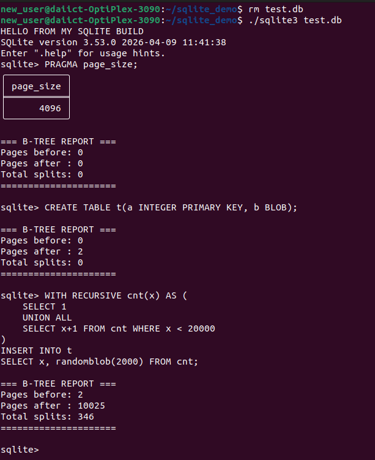
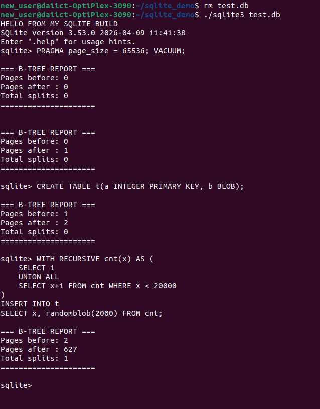
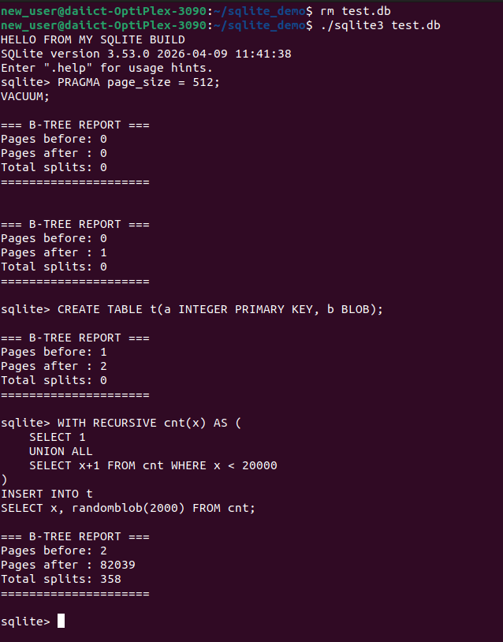

# Experiment 1: Effect of Page Size on SQLite B-Tree Splits

---

# Overview

## Objective

The purpose of this experiment is to analyze how changing the SQLite database **page size** affects:

* B-Tree growth
* Number of page splits
* Storage utilization
* Overall database behavior during large insert operations

SQLite stores table and index data inside a **B-Tree structure**.
Each B-Tree node is stored inside a fixed-size database **page**.

When a page becomes full during inserts:

* SQLite performs a **B-Tree split**
* Data is redistributed into new pages
* Parent nodes may also split recursively

This experiment helps us understand how page size directly influences:

* Tree depth
* Split frequency
* Space efficiency
* Insert performance

---

# Why Page Size Matters

SQLite stores records inside pages.

A page can be thought of as a container that holds:

* Row records
* Keys
* Pointers to child nodes

The page size determines how much data can fit into one B-Tree node.

---

## Smaller Page Size

Smaller pages mean:

* Fewer records fit into a node
* Pages become full quickly
* More B-Tree splits occur
* Tree height increases faster
* More disk pages are required

Result:

* Higher fragmentation
* Increased split overhead
* More page management work

---

## Larger Page Size

Larger pages mean:

* More records fit into each node
* Fewer splits occur
* Tree grows more slowly
* Better space utilization

Result:

* Reduced split frequency
* Lower tree depth
* Improved insert efficiency

---

# Experiment Setup

## Table Schema

```sql
CREATE TABLE t(
    a INTEGER PRIMARY KEY,
    b BLOB
);
```

---

## Insert Workload

20,000 rows were inserted using recursive SQL generation.

Each row contained:

* Integer primary key
* 2000-byte random blob

```sql
WITH RECURSIVE cnt(x) AS (
    SELECT 1
    UNION ALL
    SELECT x+1 FROM cnt WHERE x < 20000
)
INSERT INTO t
SELECT x, randomblob(2000) FROM cnt;
```

---

# Part 1 — Default Page Size (4096 Bytes)

## Purpose

This experiment establishes the baseline behavior of SQLite using its default page size.

SQLite default page size:

```sql
PRAGMA page_size;
```

Output:

```text
4096
```

---

### Before Experiment (Default Page Size)



---

## Observed Results

| Metric              | Value |
| ------------------- | ----- |
| Pages Before Insert | 2     |
| Pages After Insert  | 10025 |
| Total Splits        | 346   |

---

## Analysis

Using the default 4096-byte pages:

* The database required over 10,000 pages
* SQLite performed 346 B-Tree splits
* Pages filled at a moderate rate

This represents balanced behavior between:

* Space efficiency
* Split frequency
* Node utilization

The default configuration is optimized for general-purpose workloads.

---

# Part 2 — Increased Page Size (65536 Bytes)

## Purpose

This experiment investigates the impact of using very large database pages.

Configuration used:

```sql
PRAGMA page_size = 65536;
VACUUM;
```

---

### After Increasing Page Size



---

## Observed Results

| Metric              | Value |
| ------------------- | ----- |
| Pages Before Insert | 2     |
| Pages After Insert  | 627   |
| Total Splits        | 1     |

---

## Analysis

This configuration produced dramatically different behavior.

### Key Observations

#### 1. Huge Reduction in Splits

Splits reduced from:

```text
346 → 1
```

Reason:

* Large pages can store significantly more records
* Nodes rarely become full
* B-Tree growth becomes much slower

---

#### 2. Massive Reduction in Total Pages

Pages reduced from:

```text
10025 → 627
```

This means:

* Better space packing
* Lower tree depth
* Fewer disk page accesses

---

#### 3. Improved Storage Efficiency

Large pages reduce metadata overhead because:

* Fewer pages are needed overall
* More data fits per node
* Parent nodes require fewer updates

---

## Interpretation

This demonstrates that larger pages:

* Delay B-Tree splits
* Improve insertion efficiency
* Reduce fragmentation
* Keep the tree more compact

However, extremely large pages may also:

* Increase memory usage
* Cause larger disk reads
* Waste space for small workloads

---

# Part 3 — Reduced Page Size (512 Bytes)

## Purpose

This experiment analyzes what happens when page size becomes extremely small.

Configuration used:

```sql
PRAGMA page_size = 512;
VACUUM;
```

---

### After Reducing Page Size



---

## Observed Results

| Metric              | Value |
| ------------------- | ----- |
| Pages Before Insert | 2     |
| Pages After Insert  | 82039 |
| Total Splits        | 358   |

---

## Analysis

This configuration caused severe B-Tree expansion.

---

## Key Observations

### 1. Extremely High Page Count

Pages increased to:

```text
82039
```

Reason:

* Very small pages can hold very little data
* Each row rapidly fills a page
* SQLite allocates many more pages

---

### 2. Increased Split Frequency

Splits increased to:

```text
358
```

Compared to default:

```text
346 → 358
```

The difference in split count appears moderate, but:

* Total storage exploded
* Tree fragmentation increased heavily
* Tree traversal cost became much higher

---

### 3. High Fragmentation

Small pages create:

* More leaf nodes
* More internal nodes
* Deeper B-Tree structures

This increases:

* Pointer management
* Disk traversal overhead
* Insert maintenance cost

---

## Interpretation

This experiment demonstrates that very small pages:

* Cause excessive database growth
* Increase fragmentation
* Lead to inefficient storage usage
* Increase B-Tree maintenance overhead

---

# Comparative Analysis

| Configuration | Page Size | Pages After Insert | Total Splits |
| ------------- | --------- | ------------------ | ------------ |
| Reduced       | 512       | 82039              | 358          |
| Default       | 4096      | 10025              | 346          |
| Increased     | 65536     | 627                | 1            |

---

### Observation

* Increasing page size nearly eliminated splits entirely.
* Reducing page size caused explosive page growth.

---

# Overall Findings

## Larger Pages

Advantages:

* Fewer splits
* Compact B-Tree
* Better insert efficiency
* Reduced fragmentation

Disadvantages:

* Larger I/O units
* Potential unused space
* Higher memory cost

---

## Smaller Pages

Advantages:

* Fine-grained storage
* Smaller I/O operations

Disadvantages:

* Excessive splits
* Larger tree depth
* High fragmentation
* More page allocations

---

# Conclusion

This experiment clearly demonstrates that SQLite page size has a major impact on B-Tree behavior.

The results show:

* Larger page sizes dramatically reduce B-Tree splits
* Smaller pages cause excessive page allocation and fragmentation
* Default SQLite settings provide balanced performance
* Page size directly affects storage efficiency and tree growth

---